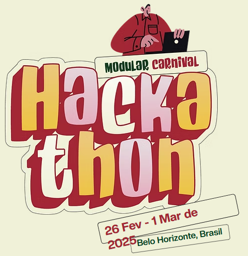

## Hi there, I´m Luciano Grossi 👋

## 🏆 Hackathon Achievements
<!--https://github.com/grossitech/grossitech/blob/main/ModularCarnivalHackathon.png?raw=true-->

  <table align="center">
    <tr>
      <td align="center">
        
         
        <b>🏅 Modular Carnival Hackathon</b>
         
        <a href="https://github.com/grossitech/FlyChain">View Project</a>
      </td>
    </tr>
  </table>

## 🔭 I’m currently working on

- Data Governance
- Exploring Web3
- Solidity Learner

## 🗣️ Languages

- 🇧🇷 Portuguese (Native)
- 🇺🇸 English
- 🇫🇷 🇮🇹 On a journey through the beauty of French and Italian

## 📫 Contact
  
  
  

<!--
**grossitech/grossitech** is a ✨ _special_ ✨ repository because its `README.md` (this file) appears on your GitHub profile.

Here are some ideas to get you started:

- 🔭 I’m currently working on ...
- 🌱 I’m currently learning ...
- 👯 I’m looking to collaborate on ...
- 🤔 I’m looking for help with ...
- 💬 Ask me about ...
- 📫 How to reach me: ...
- 😄 Pronouns: ...
- ⚡ Fun fact: ...
-->
